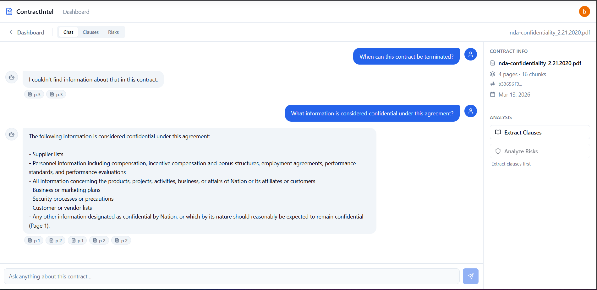
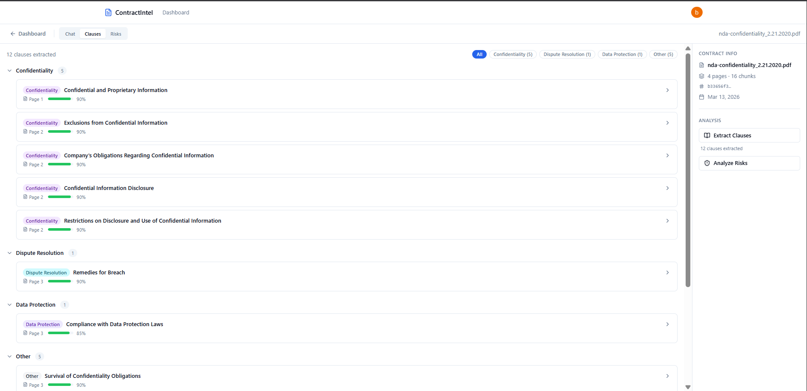
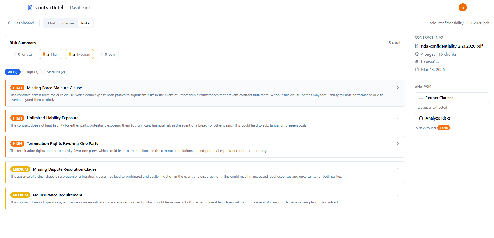

# Contract Intelligence Platform

> **AI-powered contract analysis using LangChain, RAG, and Pinecone — understand any contract in seconds.**

A full-stack demo application that lets users upload PDF contracts, ask natural language questions via **Retrieval-Augmented Generation (RAG)**, automatically extract key clauses, and flag high-risk provisions using **LLM Engineering** and **Generative AI**.

**Live Demo:** _[Deploy link placeholder]_

---

## Features

- **AI Q&A (RAG)** — Ask anything about your contract in plain English. Answers are grounded in the actual document using **Semantic Search** over a **Pinecone** vector index, powered by **OpenAI gpt-4o-mini** and **LangChain** LCEL chains.
- **Clause Extraction** — Automatically identify and categorize 14 clause types (termination, liability, payment terms, governing law, force majeure, and more) using **LangChain structured output** and Pydantic parsers.
- **Risk Analysis** — Flag auto-renewal traps, uncapped liability, unfavorable indemnification, missing protective clauses, and 7 more risk categories — each with severity scores (critical / high / medium / low) and actionable recommendations.
- **Chat History** — Follow-up questions supported via conversational context (last 10 messages passed to the LLM).
- **Source Citations** — Every AI answer is traceable to specific page numbers in the original PDF.

---

## Architecture

```
┌─────────────────────────────────────────────────────────────────────┐
│                          User Browser                               │
│           React 18 + TypeScript + Tailwind CSS + shadcn/ui          │
│        TanStack Query · Zustand · Axios · react-dropzone            │
└───────────────────────────┬─────────────────────────────────────────┘
                            │ REST API (JSON)
                            ▼
┌─────────────────────────────────────────────────────────────────────┐
│                       FastAPI (Python 3.12)                         │
│                                                                     │
│  ┌──────────────┐  ┌─────────────┐  ┌────────────┐  ┌──────────┐  │
│  │  /contracts  │  │    /chat    │  │  /clauses  │  │  /risks  │  │
│  └──────┬───────┘  └──────┬──────┘  └─────┬──────┘  └────┬─────┘  │
│         │                 │               │               │         │
│  ┌──────▼─────────────────▼───────────────▼───────────────▼──────┐ │
│  │                    LangChain Services                          │ │
│  │  pdf_parser · vector_store · rag · clause_extractor · risks   │ │
│  └──────┬──────────────────────────────────────────────┬─────────┘ │
│         │                                              │            │
└─────────┼──────────────────────────────────────────────┼────────────┘
          │                                              │
    ┌─────▼──────┐  ┌────────────┐  ┌──────────────────▼──────────┐
    │ PostgreSQL │  │Cloudflare  │  │         OpenAI API           │
    │    (SQL)   │  │    R2      │  │  gpt-4o-mini · Embeddings    │
    │ Contracts  │  │ PDF files  │  │  text-embedding-3-small      │
    │ Clauses    │  │ (S3-compat)│  └─────────────────────────────┘
    │ Risks      │  └────────────┘
    └────────────┘  ┌────────────┐  ┌──────────────────────────────┐
                    │   AWS      │  │       Pinecone Serverless     │
    ┌────────────┐  │  DynamoDB  │  │  Vector Database · Semantic   │
    │ DynamoDB   │  │ Chat Msgs  │  │  Search · 1536-dim · cosine   │
    │  Local     │  │ (primary)  │  │  per-contract namespaces      │
    │ (dev only) │  └────────────┘  └──────────────────────────────┘
    └────────────┘
```

### RAG Pipeline (LangChain LCEL)

```
PDF Upload → PyMuPDF Extraction → RecursiveCharacterTextSplitter
    → OpenAI Embeddings (text-embedding-3-small)
    → Pinecone Upsert (batch 100, namespace per contract)
    Processing: AWS Lambda (serverless) > Celery + Redis > BackgroundTasks

Query → Pinecone Similarity Search (k=5, score≥0.7)
      → Stuff Documents Chain → ChatOpenAI (gpt-4o-mini)
      → Answer + Source Citations
```

---

## Tech Stack

| Layer | Technology |
|---|---|
| **LLM / AI** | OpenAI **gpt-4o-mini**, **LangChain** (LCEL), **Prompt Engineering** |
| **Embeddings** | OpenAI **text-embedding-3-small** (1536-dim) |
| **Vector DB** | **Pinecone** Serverless — **Semantic Search**, **RAG** |
| **NLP / Parsing** | PyMuPDF, LangChain `RecursiveCharacterTextSplitter`, Pydantic structured output |
| **Backend** | **Python** 3.12, **FastAPI**, SQLAlchemy 2.0 async, Alembic, Pydantic v2 |
| **Database** | **PostgreSQL** 16 (**SQL**), async via asyncpg |
| **Chat Storage** | **AWS DynamoDB** — high-volume chat messages, on-demand pricing, PostgreSQL fallback |
| **Serverless** | **AWS Lambda** — containerized PDF processing, **ECR** container registry |
| **File Storage** | **Cloudflare R2** (S3-compatible), presigned URLs via boto3 |
| **Frontend** | **React** 18, **TypeScript**, Vite, Tailwind CSS, shadcn/ui |
| **State** | TanStack Query (server), Zustand (client) |
| **Containerization** | **Docker**, Docker Compose |
| **Deployment** | **Vercel** (frontend), **Render** (backend), **Cloudflare R2** (storage) |

---

## Project Structure

```
contract-intel/
├── docker-compose.yml
├── .env.example
├── lambda/
│   └── process-contract/   # AWS Lambda for serverless PDF processing
│       ├── handler.py      # Lambda entry point (parse → chunk → embed → upsert)
│       ├── Dockerfile       # ECR container image (python:3.12 Lambda base)
│       └── requirements.txt
├── backend/
│   ├── app/
│   │   ├── main.py              # FastAPI app, CORS, global error handlers
│   │   ├── config.py            # Pydantic Settings
│   │   ├── models/              # SQLAlchemy 2.0 ORM models
│   │   ├── schemas/             # Pydantic v2 request/response schemas
│   │   ├── routers/             # REST endpoints (contracts, chat, clauses, risks)
│   │   └── services/
│   │       ├── storage.py       # Cloudflare R2 upload/download
│   │       ├── pdf_parser.py    # PyMuPDF + LangChain chunking
│   │       ├── vector_store.py  # Pinecone + OpenAI Embeddings
│   │       ├── rag.py           # LangChain LCEL retrieval chain
│   │       ├── clause_extractor.py  # LangChain structured output
│   │       ├── risk_analyzer.py     # LangChain risk analysis
│   │       ├── dynamodb.py      # AWS DynamoDB chat message storage
│   │       └── lambda_service.py # AWS Lambda invocation for PDF processing
│   ├── scripts/
│   │   └── create_dynamodb_table.py  # DynamoDB table setup script
│   └── alembic/                 # Database migrations
└── frontend/
    └── src/
        ├── api/client.ts        # Axios with response envelope unwrapping
        ├── components/          # Chat, clauses, risks, upload UI
        ├── hooks/useContract.ts # TanStack Query hooks
        ├── pages/               # Landing, Dashboard, ContractDetail
        ├── store/chatStore.ts   # Zustand store
        └── types/index.ts       # TypeScript interfaces (no `any`)
```

---

## Setup Instructions

### Prerequisites

- Docker & Docker Compose
- OpenAI API key
- Pinecone account (free Serverless tier works)
- Cloudflare R2 bucket (or any S3-compatible storage)

### 1. Clone and configure

```bash
git clone <repo-url>
cd contract-intel
cp .env.example .env
```

Edit `.env` and fill in:

```env
# Database (auto-configured for Docker)
DATABASE_URL=postgresql+asyncpg://postgres:postgres@db:5432/contract_intel

# OpenAI
OPENAI_API_KEY=sk-...

# Pinecone
PINECONE_API_KEY=pcsk_...
PINECONE_INDEX_NAME=contract-intelligence

# Cloudflare R2
R2_ENDPOINT_URL=https://<account_id>.r2.cloudflarestorage.com
R2_ACCESS_KEY_ID=...
R2_SECRET_ACCESS_KEY=...
R2_BUCKET_NAME=contract-intelligence

# CORS (comma-separated for multiple origins)
CORS_ORIGINS=http://localhost:5173
```

Frontend `.env` (in `frontend/`):

```env
VITE_API_URL=http://localhost:8000
```

### 2. Start services

```bash
docker compose up --build
```

This starts:
- **PostgreSQL** on port 5432
- **DynamoDB Local** on port 8001 (in-memory, for chat messages)
- **FastAPI** on port 8000 (hot reload)
- **React dev server** on port 5173 (hot reload)

### 3. Run database migrations and create DynamoDB table

```bash
docker compose exec api alembic upgrade head
docker compose exec api python -m scripts.create_dynamodb_table
```

> **Note:** Chat messages are stored in DynamoDB when `USE_DYNAMODB=true` (default in Docker Compose). Set `USE_DYNAMODB=false` to fall back to PostgreSQL.

### 4. Open the app

Navigate to [http://localhost:5173](http://localhost:5173) and upload a PDF contract.

---

## API Reference

All responses follow a consistent envelope:

```json
// Success
{ "success": true, "data": { ... } }

// Error
{ "success": false, "error": { "code": "404", "message": "Contract not found" } }
```

| Method | Endpoint | Description |
|---|---|---|
| `GET` | `/api/v1/health` | Health check + DB ping |
| `POST` | `/api/v1/contracts/upload-url` | Get presigned R2 upload URL |
| `POST` | `/api/v1/contracts/{id}/confirm-upload` | Trigger processing pipeline |
| `GET` | `/api/v1/contracts` | List all contracts |
| `GET` | `/api/v1/contracts/{id}` | Get contract by ID |
| `DELETE` | `/api/v1/contracts/{id}` | Delete contract (DB + R2 + Pinecone) |
| `POST` | `/api/v1/contracts/{id}/chat` | RAG Q&A |
| `GET` | `/api/v1/contracts/{id}/chat/history` | Conversation history |
| `POST` | `/api/v1/contracts/{id}/extract-clauses` | Trigger clause extraction |
| `GET` | `/api/v1/contracts/{id}/clauses` | Get clauses grouped by type |
| `POST` | `/api/v1/contracts/{id}/analyze-risks` | Trigger risk analysis |
| `GET` | `/api/v1/contracts/{id}/risks` | Get risks with severity counts |

---

## Infrastructure (Terraform)

All cloud infrastructure is defined as code in the `infrastructure/` directory using Terraform:

| Resource | Provider | Purpose |
|----------|----------|---------|
| Web Service | Render | FastAPI backend (Docker) |
| PostgreSQL | Render | Contract and user metadata |
| DynamoDB Table | AWS | Chat message storage (on-demand) |
| Lambda Function | AWS | Serverless PDF processing (container image) |
| ECR Repository | AWS | Container registry for Lambda image |
| IAM Role | AWS | Lambda execution role |
| R2 Bucket | Cloudflare | PDF file storage |
| Vector Index | Pinecone | Semantic search embeddings |

See [`infrastructure/README.md`](infrastructure/README.md) for setup instructions.

---

## Cloud Deployment

### Frontend → Vercel

```bash
cd frontend
npm run build
# Deploy dist/ to Vercel
# Set VITE_API_URL to your Render backend URL
```

### Backend → Render

- Connect repo, set root to `backend/`
- Add all env vars from `.env` (update `DATABASE_URL` to Render Postgres URL, `CORS_ORIGINS` to Vercel domain)
- Build command: `pip install -r requirements.txt && alembic upgrade head`
- Start command: `uvicorn app.main:app --host 0.0.0.0 --port $PORT`

---

## Key Engineering Decisions

- **LangChain LCEL** over raw OpenAI SDK calls — composable, testable, swap-friendly
- **Pinecone namespaces** per contract — zero cross-contamination between users' documents
- **Presigned upload URLs** — client uploads directly to R2, backend never proxies file bytes
- **Background tasks** with independent DB sessions — FastAPI's request session closes before processing finishes
- **Jaccard deduplication** on extracted clauses — chunks overlap, so the same clause can appear multiple times; deduplication keeps the highest-confidence version
- **Similarity score threshold 0.7** on retrieval — prevents hallucination from low-quality matches
- **DynamoDB for chat messages** with PostgreSQL fallback — `USE_DYNAMODB` flag switches between DynamoDB (high-volume, schema-flexible) and PostgreSQL; Render deploys without AWS default to PostgreSQL
- **Three-way processing fallback** — PDF processing uses AWS Lambda (serverless, 1 GB RAM, 5-min timeout) when `USE_LAMBDA=true`, falls back to Celery + Redis, then to FastAPI BackgroundTasks. Lambda only handles `process_contract`; clause extraction and risk analysis remain on Celery/BackgroundTasks

---

## Screenshots

### Chat — RAG Q&A with Source Citations


### Clause Extraction — Grouped by Type


### Risk Analysis — Severity Breakdown


---

## Keywords

`LangChain` · `RAG` · `Retrieval-Augmented Generation` · `Vector Database` · `Pinecone` · `LLM Engineering` · `NLP` · `Generative AI` · `Prompt Engineering` · `OpenAI` · `gpt-4o-mini` · `Embeddings` · `Semantic Search` · `Python` · `FastAPI` · `React` · `TypeScript` · `PostgreSQL` · `SQL` · `AWS Lambda` · `AWS DynamoDB` · `AWS ECR` · `Serverless` · `Docker` · `Cloud Deployment` · `Vercel` · `Render` · `Cloudflare R2`
